<div align="center">


---

# ATLASWAY

## Plateforme Intelligente de Covoiturage au Maroc

---

**Projet de Fin d\'Études**

| | |
|---|---|
| **Auteurs** | Adam Khoulani — Yassine H. |
| **Encadrant** | À compléter |
| **Établissement** | ESISA — École Supérieure d\'Ingénierie en Sciences Appliquées |
| **Filière** | Génie Logiciel / Ingénierie Informatique |
| **Année académique** | 2024 – 2025 |
| **Date de soutenance** | Juin 2025 |

---

*Document technique confidentiel — usage académique*

</div>

---

## Table des Matières

1. [Résumé Exécutif](#1-résumé-exécutif)
2. [Introduction](#2-introduction)
3. [Contexte et Problématique](#3-contexte-et-problématique)
4. [Objectifs du Projet](#4-objectifs-du-projet)
5. [Analyse des Besoins Fonctionnels](#5-analyse-des-besoins-fonctionnels)
6. [Besoins Non Fonctionnels](#6-besoins-non-fonctionnels)
7. [Technologies Utilisées](#7-technologies-utilisées)
8. [Architecture Globale](#8-architecture-globale)
9. [Architecture Backend](#9-architecture-backend)
10. [Architecture Frontend](#10-architecture-frontend)
11. [Architecture de l\'Application Mobile](#11-architecture-de-lapplication-mobile)
12. [Conception de la Base de Données](#12-conception-de-la-base-de-données)
13. [Authentification et Autorisation](#13-authentification-et-autorisation)
14. [Intégration de l\'Intelligence Artificielle](#14-intégration-de-lintelligence-artificielle)
15. [Système de Messagerie](#15-système-de-messagerie)
16. [Gestion des Trajets](#16-gestion-des-trajets)
17. [Flux de Réservation](#17-flux-de-réservation)
18. [Portefeuille et Paiements Stripe](#18-portefeuille-et-paiements-stripe)
19. [Système de Notifications](#19-système-de-notifications)
20. [Vérification des Conducteurs](#20-vérification-des-conducteurs)
21. [Tableau de Bord Administrateur](#21-tableau-de-bord-administrateur)
22. [Sécurité de la Plateforme](#22-sécurité-de-la-plateforme)
23. [Aperçu de l\'API REST](#23-aperçu-de-lapi-rest)
24. [Structure du Projet](#24-structure-du-projet)
25. [Organisation du Code](#25-organisation-du-code)
26. [Stratégie de Tests](#26-stratégie-de-tests)
27. [Considérations de Performance](#27-considérations-de-performance)
28. [Scalabilité](#28-scalabilité)
29. [Déploiement](#29-déploiement)
30. [Points Forts du Projet](#30-points-forts-du-projet)
31. [Limitations](#31-limitations)
32. [Améliorations Futures](#32-améliorations-futures)
33. [Conclusion](#33-conclusion)
34. [Références](#34-références)

---
## 1. Résumé Exécutif

AtlasWay est une plateforme complète de covoiturage destinée au marché marocain, développée dans le cadre d'un projet de fin d'études d'ingénierie logicielle. Elle repose sur une architecture full-stack moderne combinant un backend Node.js/Express/MongoDB, un frontend React 18 Progressive Web App (PWA), et une application mobile React Native.

La plateforme intègre des fonctionnalités avancées rarement présentes dans les solutions de covoiturage régionales : un chatbot multilingue (français/darija) propulsé par l'API Groq avec le modèle Llama 3.1, un système de prédiction de la demande par intelligence artificielle via Ollama et Llama 3, une vérification documentaire automatisée des conducteurs par vision artificielle (LLaVA), ainsi qu'un réseau social intégré (stories, groupes, événements, fil d'actualité).

La sécurité constitue un pilier central de la conception : authentification JWT avec révocation immédiate, OTP cryptographique, hachage bcrypt au facteur 12, headers HTTP durcis via Helmet, limitation de débit multicouche et journal d'audit exhaustif des actions administratives.

Le projet couvre l'ensemble du cycle de vie d'une réservation de covoiturage, depuis la publication d'un trajet jusqu'au paiement en ligne via Stripe, en passant par la communication temps réel via Socket.io, les notifications push VAPID, et un tableau de bord analytique pour les administrateurs et les conducteurs.

---

## 2. Introduction

Le covoiturage représente une alternative de mobilité durable qui connaît un essor mondial. Au Maroc, malgré un réseau routier reliant les 48 principales villes du royaume, l'offre de transport interurbain reste dominée par des opérateurs traditionnels (CTM, Supratours) dont les tarifs et la flexibilité laissent à désirer pour une frange importante de la population.

AtlasWay se positionne comme la première plateforme de covoiturage 100 % marocaine, pensée pour les contraintes et usages locaux : prise en charge du français et de la darija, intégration des fêtes et événements marocains dans les prédictions IA, vérification d'identité via la Carte d'Identité Nationale (CIN), et tarification en dirhams marocains (MAD).

Ce rapport décrit en détail l'architecture technique, les choix de conception, les fonctionnalités implémentées et les perspectives d'évolution du projet. Il s'adresse à un jury académique, à des ingénieurs logiciels et à toute partie prenante souhaitant comprendre la profondeur technique de la solution.

---

## 3. Contexte et Problématique

### 3.1 Contexte Socio-Économique

Le Maroc compte environ 37 millions d'habitants répartis sur un territoire de 710 000 km². Les déplacements interurbains représentent un enjeu quotidien pour des millions de Marocains : étudiants rejoignant leurs universités, travailleurs naviguant entre villes, familles se retrouvant lors des fêtes nationales et religieuses (Aïd El Fitr, Aïd El Adha, Ramadan).

Le taux de motorisation reste relativement faible (environ 120 véhicules pour 1 000 habitants), créant une demande structurelle pour des solutions de mobilité partagée.

### 3.2 Problèmes Identifiés

| Problème | Impact |
|---|---|
| Coût élevé des transports traditionnels | Inaccessibilité économique pour les étudiants et revenus modestes |
| Manque de flexibilité horaire des opérateurs historiques | Contrainte sur les déplacements de dernière minute |
| Absence de plateforme numérique marocaine de covoiturage | Dépendance à des solutions étrangères inadaptées au contexte local |
| Déficit de confiance entre usagers inconnus | Frein à l'adoption du covoiturage |
| Pas de vérification d'identité dans les solutions informelles | Risques de sécurité pour les passagers |
| Opérations de paiement non sécurisées | Transactions en espèces, risques de non-paiement |

### 3.3 Opportunité

L'émergence d'une classe moyenne connectée, le taux de pénétration des smartphones supérieur à 70 % et la croissance des paiements numériques au Maroc créent les conditions favorables à l'adoption d'une solution de covoiturage numérique fiable et localisée.

---

## 4. Objectifs du Projet

### 4.1 Objectif Principal

Concevoir et développer une plateforme de covoiturage interurbain au Maroc, sécurisée, intelligente et accessible, connectant conducteurs et passagers via une expérience numérique fluide.

### 4.2 Objectifs Spécifiques

1. **Fiabilité** — Assurer la disponibilité de la plateforme avec une architecture robuste et des mécanismes de tolérance aux pannes.
2. **Sécurité** — Mettre en place une chaîne de sécurité complète : authentification, vérification d'identité, chiffrement et audit.
3. **Intelligence** — Intégrer l'IA pour améliorer l'expérience utilisateur : chatbot, prédictions de demande, vérification documentaire.
4. **Temps réel** — Fournir une communication instantanée entre les acteurs (messagerie, notifications, suivi GPS).
5. **Paiement sécurisé** — Permettre les transactions financières via un prestataire de paiement certifié PCI-DSS (Stripe).
6. **Accessibilité** — Proposer une interface responsive et une PWA installable, adaptée aux contraintes de connectivité mobile marocaine.
7. **Modération** — Offrir aux administrateurs les outils nécessaires pour garantir la qualité et la sécurité des échanges sur la plateforme.

---

## 5. Analyse des Besoins Fonctionnels

### 5.1 Module d'Authentification

| Fonctionnalité | Description |
|---|---|
| Inscription | Formulaire avec prénom, nom, email, mot de passe (≥ 8 chars), téléphone optionnel, code de parrainage |
| Vérification OTP | Code à 6 chiffres valable 10 minutes, envoyé par email ou SMS au choix |
| Connexion | Email + mot de passe, retourne un token JWT valable 7 jours |
| Mot de passe oublié | Envoi d'un OTP par email, réinitialisation sécurisée |
| Changement de mot de passe | Depuis le profil utilisateur authentifié |
| Révocation immédiate | Statut du compte vérifié en base à chaque requête (pas seulement au login) |
| Blocage de compte | Comptes `suspended` ou `blocked` perdent l'accès instantanément |

### 5.2 Module Profil Utilisateur

- Consultation et édition du profil (nom, téléphone, bio, langues parlées)
- Préférences de trajet : musique, tabagisme, animaux de compagnie, conversation
- Upload de photo de profil, photo de véhicule, documents justificatifs (CIN, permis, carte grise)
- Informations conducteur : marque/modèle/couleur/année/plaque
- Préférences d'accessibilité PMR (personne à mobilité réduite)
- Profil public consultable avec trajets actifs et avis reçus
- Onboarding obligatoire après inscription (choix du rôle passager/conducteur)
- Code de parrainage personnel (format `AT-XXXXXX`)

### 5.3 Module Trajets

| Fonctionnalité | Détails |
|---|---|
| Publication | Ville départ/arrivée, date, prix, places, description, réservation instantanée, récurrence |
| Recherche avancée | Filtres : date, fourchette de prix, note minimum conducteur, conducteurs vérifiés uniquement, PMR, nombre de places, mode de transport |
| Tri | Par heure de départ, prix croissant/décroissant, meilleures notes |
| Comparaison | Comparateur de trajets entre deux mêmes villes |
| Recherches sauvegardées | Notification automatique à la publication d'un trajet correspondant |
| Suivi GPS | Page de suivi en temps réel via carte Leaflet |
| Modes de transport | Voiture, moto, minibus, van |
| Trajets récurrents | Publication avec jours de récurrence |

### 5.4 Module Réservations

- Réserver des places sur un trajet (avec message optionnel au conducteur)
- Réservation instantanée (auto-acceptée) ou en attente de validation conducteur
- Conducteur : accepter / refuser une réservation en attente
- Passager : annuler sa réservation
- Historique des trajets passés et à venir
- Calcul et affichage du CO2 économisé
- Compteur de réservations en attente dans la navbar
- Restriction : les comptes admin/superadmin ne peuvent pas réserver de trajet

### 5.5 Module Avis et Notation

- Avis post-trajet (note globale 1-5, sous-critères : ponctualité, conduite, communication, propreté)
- Vérification de l'existence d'une réservation acceptée avant autorisation de noter
- Mise à jour automatique de la note moyenne (avgRating) et du compteur (totalRatings)
- Réponse du conducteur/passager noté possible

### 5.6 Module Messagerie

- Conversations directes entre deux utilisateurs (création automatique au premier message)
- Conversations de groupe liées à un trajet
- Réactions emoji sur les messages
- Indicateur "en train d'écrire" en temps réel (Socket.io)
- Compteur de messages non lus avec badge dans la navbar
- Canal de contact direct avec les administrateurs

### 5.7 Module Réseau Social

| Sous-module | Fonctionnalités |
|---|---|
| Amis | Envoi/acceptation/refus de demandes, liste d'amis, amis en commun |
| Fil d'actualité | Posts texte ou annonces de trajet, likes, commentaires |
| Stories | Contenu éphémère (image/vidéo) avec expiration automatique |
| Groupes | Création de groupes publics/privés, adhésion, messagerie de groupe |
| Événements | Création d'événements par ville (concerts, festivals, conférences, sport) |

### 5.8 Module Tableau de Bord Conducteur

- Statistiques : trajets réalisés, passagers transportés, gains totaux/mensuels, CO2 économisé, distance parcourue
- Système de badges : Premier trajet, Conducteur vérifié, Top noté, Vétéran (50 trajets), Éco-guerrier, Ambassadeur (1000 km)
- Niveaux de progression : Bronze → Argent → Or → Platine → Diamant
- Analytics détaillés avec graphiques (notes par mois, répartition des réservations)
- Prédictions IA de demande (notifications proactives)

### 5.9 Module Administration

**Tableau de bord** : statistiques globales (utilisateurs, conducteurs, trajets, réservations, avis, signalements, comptes bannis) avec graphiques temps réel.

**Gestion des utilisateurs** :
- Liste paginée avec recherche multicritères (nom, email, téléphone)
- Détail complet : infos, statut, historique, signalements reçus/envoyés, avis
- Actions : suspendre, réactiver, bannir, supprimer (avec garde-fous RBAC)

**Gestion des trajets** :
- Annulation ou suppression définitive (en transaction MongoDB)
- Visualisation des réservations associées

**Modération des signalements** :
- Motifs : comportement, fraude, sécurité, contenu inapproprié, trajet suspect, conduite dangereuse, impolitesse, no-show, escroquerie, harcèlement
- Workflow : en attente → en cours → résolu/rejeté avec note administrative

**Journal d'audit** :
- Enregistrement de chaque action sensible : qui, quoi, sur quelle cible, quand, depuis quelle IP
- Filtres par type d'action et type de cible

**Gestion des admins** (superadmin uniquement) :
- Lister, créer, supprimer des comptes administrateurs

### 5.10 Module Portefeuille et Paiements

- Consultation du solde et de l'historique des transactions
- Recharge du portefeuille via Stripe Checkout (Checkout Session)
- Webhook Stripe avec vérification HMAC de signature
- Transactions créditées automatiquement à réception de l'événement checkout.session.completed
- Gestion des codes promotionnels

### 5.11 Fonctionnalités Complémentaires

| Module | Fonctionnalités |
|---|---|
| Contacts d'urgence | Gestion des contacts à prévenir en cas d'urgence |
| Alertes trajet | Alertes automatiques sur les nouvelles publications |
| Favoris | Sauvegarde de trajets favoris |
| File d'attente | Waitlist pour les trajets complets |
| Support | Tickets de support avec suivi |
| Abonnement Premium | Plans mensuel/annuel |
| Leaderboard | Classement des meilleurs conducteurs |
| Historique de connexion | Journal des connexions par appareil/IP |
| Exportation RGPD | Téléchargement et suppression des données personnelles |
| Entreprise | Dashboard dédié aux comptes entreprise |
| Hub de mobilité | Agrégateur de modes de transport |

---

## 6. Besoins Non Fonctionnels

| Catégorie | Exigence |
|---|---|
| **Performance** | Réponse API < 200 ms pour les requêtes courantes, chargement initial frontend < 2 s |
| **Disponibilité** | Architecture déployée sur Render (backend) + Vercel (frontend), auto-ping de 14 min |
| **Sécurité** | HTTPS obligatoire, JWT signé, bcrypt (facteur 12), Helmet, CORS restrictif, rate limiting multicouche |
| **Scalabilité** | Architecture stateless (backend), séparation frontend/backend, MongoDB Atlas (cloud) |
| **Maintenabilité** | Séparation en couches (contrôleurs, services, modèles), gestion centralisée des erreurs |
| **Accessibilité** | Lien "passer au contenu" (skip link), support ARIA, interface PMR |
| **Compatibilité** | PWA installable (Chrome, Firefox, Edge, Safari iOS), React Native (iOS et Android) |
| **RGPD** | Export et suppression des données sur demande via /privacy |
| **Internationalisation** | Français + darija marocaine (AtlasBot), structure i18n dans le frontend |

---

## 7. Technologies Utilisées

### 7.1 Stack Technique

| Couche | Technologie | Version | Rôle |
|---|---|---|---|
| **Runtime backend** | Node.js | 18+ | Environnement d'exécution JavaScript côté serveur |
| **Framework backend** | Express.js | 4.18 | Framework HTTP minimaliste et flexible |
| **Base de données** | MongoDB + Mongoose | 8.20 | Base documentaire NoSQL avec ODM |
| **Temps réel** | Socket.io | 4.8 | Communication bidirectionnelle WebSocket |
| **Frontend** | React | 18.2 | Bibliothèque UI déclarative avec hooks |
| **Build frontend** | Vite | 7.3 | Bundler ultra-rapide avec HMR |
| **CSS** | Tailwind CSS | 3.4 | Framework utilitaire CSS |
| **Routing frontend** | React Router | 6.22 | Navigation SPA côté client |
| **PWA** | vite-plugin-pwa | — | Service Worker, manifest, notifications push |
| **Cartes** | Leaflet + react-leaflet | 1.9 / 4.2 | Cartes interactives OpenStreetMap |
| **Graphiques** | Recharts | 3.9 | Graphiques React basés sur D3 |
| **QR Code** | qrcode.react | 4.2 | Génération de QR codes côté client |
| **Mobile** | React Native | — | Applications iOS et Android natives |
| **Navigation mobile** | React Navigation | — | Navigation native mobile |

### 7.2 Services et APIs Externes

| Service | Usage |
|---|---|
| **Groq API (llama-3.1-8b-instant)** | AtlasBot — chatbot IA bilingue |
| **Ollama (llama3 / mistral)** | Prédictions de demande par route |
| **Ollama (llava)** | Vérification visuelle des documents conducteur |
| **Stripe** | Paiements en ligne, Checkout Sessions, webhooks |
| **Nodemailer / Gmail** | Envoi d'emails transactionnels (OTP, confirmations) |
| **Twilio** | SMS OTP (fallback console si non configuré) |
| **Web Push (VAPID)** | Notifications push navigateur |
| **Cloudinary** | Stockage CDN des médias (dépendance installée) |

### 7.3 Sécurité et Qualité

| Bibliothèque | Rôle |
|---|---|
| **helmet** | Headers HTTP de sécurité (XSS, clickjacking, MIME sniffing) |
| **express-rate-limit** | Limitation de débit multicouche |
| **bcryptjs** | Hachage des mots de passe (facteur 12) |
| **jsonwebtoken** | Génération et vérification des tokens JWT |
| **express-validator** | Validation et assainissement des entrées |
| **morgan** | Journalisation des requêtes HTTP |
| **multer** | Gestion sécurisée des uploads de fichiers |
| **jest + supertest** | Tests unitaires et d'intégration backend |
| **vitest** | Tests frontend (React Testing Library) |

---
## 8. Architecture Globale

### 8.1 Vue d'Ensemble

AtlasWay repose sur une architecture en couches distinctes, chacune ayant une responsabilité clairement définie. Le backend expose une API REST consommée par le frontend web et l'application mobile. La communication temps réel est assurée par Socket.io sur le même serveur HTTP.

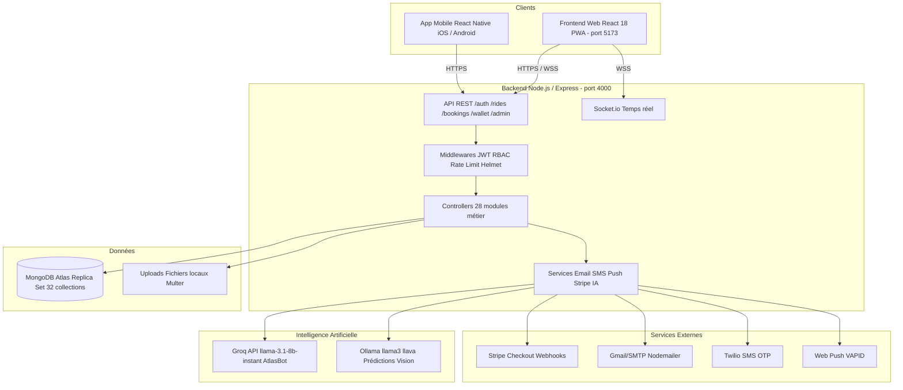

### 8.2 Flux de Données Principal

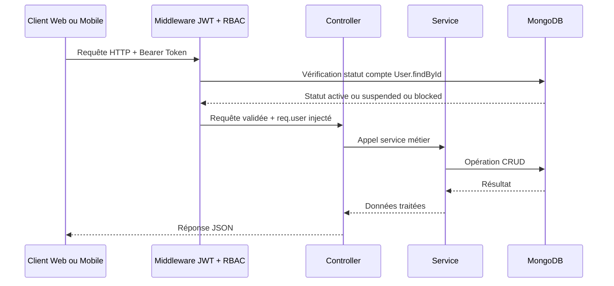

---

## 9. Architecture Backend

### 9.1 Structure Modulaire

Le backend suit le pattern MVC étendu avec une couche de services dédiée aux intégrations tierces et à la logique réutilisable.

```mermaid
graph LR
    subgraph Routes["Routes Express Router"]
        R1["/auth"]
        R2["/rides"]
        R3["/bookings"]
        R4["/wallet"]
        R5["/admin"]
        R6["/chat"]
        R7["30+ autres routes"]
    end

    subgraph Middleware["Middlewares"]
        AUTH["authenticateToken JWT + DB check"]
        RBAC["authorizeRoles user admin superadmin"]
        RATE["Rate Limiting express-rate-limit"]
        VALID["express-validator Sanitisation"]
        UPLOAD["Multer Upload fichiers"]
        AUDIT["auditMiddleware Journal admin"]
    end

    subgraph Controllers["Controllers"]
        C1["authController"]
        C2["rideController"]
        C3["bookingController"]
        C4["walletController"]
        C5["adminController"]
        C6["chatController"]
        C7["22 autres"]
    end

    subgraph Services["Services"]
        S1["emailService Nodemailer"]
        S2["stripeService Checkout Webhook"]
        S3["ollamaService Groq AtlasBot"]
        S4["ollamaVisionService llava Docs"]
        S5["predictionService llama3 Demande"]
        S6["notificationService In-app Push"]
        S7["smsService Twilio"]
        S8["auditLogService Journal"]
        S9["savedSearchService Alertes"]
    end

    subgraph Models["Modèles Mongoose"]
        M1["User"]
        M2["Ride"]
        M3["Booking"]
        M4["Transaction"]
        M5["Message"]
        M6["27 autres modèles"]
    end

    Routes --> Middleware
    Middleware --> Controllers
    Controllers --> Services
    Controllers --> Models
    Services --> Models
```

### 9.2 Point d'Entrée — index.js

L'entrée du serveur configure dans l'ordre suivant :
1. Helmet (headers de sécurité HTTP)
2. CORS avec liste blanche de domaines
3. Webhook Stripe (body brut, avant express.json)
4. express.json pour le parsing standard
5. Morgan (journalisation HTTP)
6. Rate limiting global (2 000 requêtes / 15 min)
7. Toutes les routes métier (30+ groupes)
8. Gestionnaires d'erreurs centralisés (404 + erreur générique)

Au démarrage asynchrone :
- Connexion MongoDB (Mongoose)
- Seed des comptes admin/superadmin
- Vérification disponibilité Ollama et modèle vision
- Génération initiale des prédictions IA
- Planification du rafraîchissement des prédictions (toutes les 24 h)
- Self-ping toutes les 14 min en production (maintenir Render actif)

### 9.3 Gestion des Erreurs

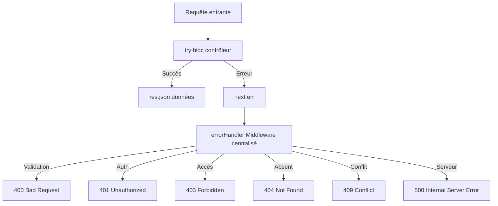

---

## 10. Architecture Frontend

### 10.1 Structure de l'Application React

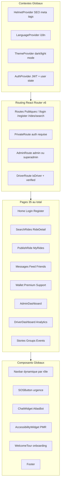

### 10.2 Stratégie de Chargement

Le frontend applique une stratégie de code splitting agressive :

- **Chargement immédiat (eager)** : pages critiques above the fold — Home, Login, Register, Onboarding, NotFound.
- **Chargement différé (lazy + Suspense)** : toutes les autres pages via React.lazy().
- **Pré-bundling** : Vite pré-bundle toutes les dépendances au démarrage pour éviter la ré-optimisation.
- **Chunks manuels** : vendor-react, vendor-charts, vendor-maps, vendor-socket, vendor-ui.

### 10.3 Progressive Web App (PWA)

AtlasWay est distribuée en tant que PWA grâce à vite-plugin-pwa (stratégie injectManifest) :

| Fonctionnalité PWA | Détail |
|---|---|
| Installation sur l'écran d'accueil | Icônes 192x192 et 512x512 px |
| Mode hors ligne | Service Worker personnalisé public/sw.js |
| Notifications push | API Push VAPID intégrée au Service Worker |
| Thème | Couleur primaire #E8192C rouge AtlasWay |
| Orientation | Portrait principal mobile |
| Shortcuts PWA | Rechercher un trajet et Publier un trajet |

### 10.4 Gestion d'État

| Type d'état | Solution |
|---|---|
| Authentification globale | AuthContext React Context + useReducer |
| Thème dark/light | ThemeContext |
| Langue | LanguageContext |
| État local composants | useState useEffect useCallback |
| Cache réseau | Axios avec intercepteurs |

---

## 11. Architecture de l'Application Mobile

### 11.1 État Actuel

L'application mobile AtlasWay est développée en React Native et cible iOS et Android. Elle est en phase d'initialisation du socle technique avec le flux d'authentification complet implémenté.

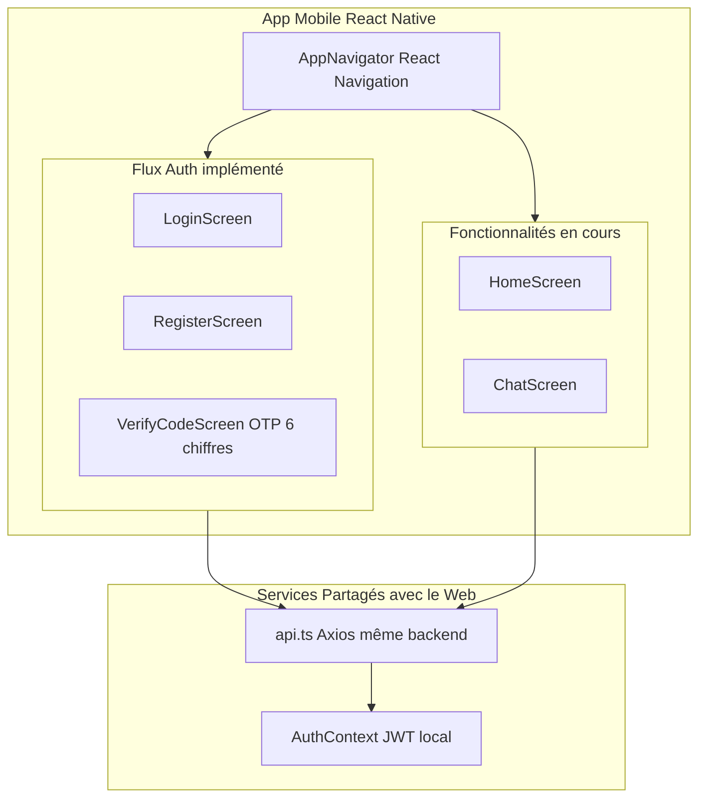

### 11.2 Composants Implémentés

| Écran | Statut | Description |
|---|---|---|
| LoginScreen | Complet | Connexion email/mot de passe avec validation |
| RegisterScreen | Complet | Inscription avec choix de méthode de vérification |
| VerifyCodeScreen | Complet | Saisie OTP 6 chiffres, minuterie de renvoi |
| HomeScreen | En cours | Écran d'accueil post-connexion |
| ChatScreen | En cours | Interface de messagerie |
| Trajets et réservations | Prévu | Portage des fonctionnalités métier |

### 11.3 Choix Techniques

- **Navigation** : React Navigation avec createNativeStackNavigator — animations natives et gestion du bouton retour OS.
- **API** : Client Axios partagé pointant vers le même backend Node.js/Express que le web.
- **Cartographie** : Google Maps intégré (préparé dans les dépendances).
- **Typage** : TypeScript strict (fichiers .tsx/.ts).
- **Couleur** : Identité visuelle cohérente (#0F0704 fond sombre, #C1272D rouge AtlasWay).

---

## 12. Conception de la Base de Données

### 12.1 Choix Technologique

MongoDB a été choisi pour sa flexibilité de schéma, sa scalabilité horizontale et son intégration native avec JavaScript via Mongoose ODM. La configuration en Replica Set à un nœud permet l'utilisation des transactions ACID multi-documents, nécessaires pour les opérations de portefeuille.

### 12.2 Vue d'Ensemble des Relations

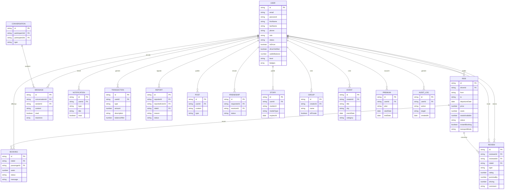

### 12.3 Description des Collections Principales

| Collection | Description |
|---|---|
| users | Profils, rôles, portefeuille, badges, niveau, documents conducteur |
| rides | Publication de trajets, disponibilité, mode de transport |
| bookings | Liaison trajet/passager, statut, places réservées |
| reviews | Notes multi-critères conducteur et passager |
| messages | Contenu, réactions emoji, statut de lecture |
| conversations | Conversations directes et de groupe |
| conversationmembers | Liaison utilisateur/conversation groupe |
| notifications | Notifications in-app par type |
| transactions | Crédits et débits du portefeuille |
| reports | Signalements avec workflow de modération |
| posts | Fil d'actualité, annonces de trajet |
| friendships | Demandes d'amitié (pending/accepted/rejected) |
| stories | Médias éphémères avec date d'expiration |
| groups | Communautés public/privé |
| events | Événements par ville et catégorie |
| premium | Abonnements mensuel/annuel |
| predictions | Prédictions IA de demande par axe |
| auditlogs | Journal de toutes les actions sensibles |
| verificationcodes | Codes OTP avec TTL automatique (10 min) |
| savedsearches | Recherches sauvegardées pour alertes |
| ridealerts | Alertes nouvelles publications |
| favoriterides | Trajets favoris |
| waitlistentries | File d'attente trajets complets |
| supporttickets | Tickets de support avec suivi |
| emergencycontacts | Contacts d'urgence personnels |
| pushsubscriptions | Endpoints VAPID pour push notifications |
| loginhistory | Historique des connexions par appareil/IP |
| promocodes | Codes promotionnels et réductions |

### 12.4 Indexation MongoDB

```javascript
// Rides — recherche par route, date, statut
rideSchema.index({ from: 1, to: 1, departureDate: 1, status: 1 });
rideSchema.index({ driverId: 1 });
rideSchema.index({ status: 1, departureDate: 1 });

// Bookings — agrégation par trajet et statut
bookingSchema.index({ rideId: 1, status: 1 });
bookingSchema.index({ passengerId: 1 });

// Messages — tri chronologique par conversation
messageSchema.index({ conversationId: 1, createdAt: -1 });
messageSchema.index({ conversationId: 1, read: 1, senderId: 1 });

// Notifications — tri par utilisateur et date
notificationSchema.index({ userId: 1, createdAt: -1 });
notificationSchema.index({ userId: 1, read: 1 });

// Reports — filtrage par statut
reportSchema.index({ status: 1 });
reportSchema.index({ reportedUserId: 1 });
```

---

## 13. Authentification et Autorisation

### 13.1 Flux d'Authentification Complet

```mermaid
sequenceDiagram
    participant U as Utilisateur
    participant FE as Frontend
    participant BE as Backend
    participant DB as MongoDB
    participant EMAIL as Email ou SMS

    rect rgb(20, 40, 60)
        Note over U,EMAIL: INSCRIPTION
        U->>FE: Formulaire inscription
        FE->>BE: POST /auth/register
        BE->>DB: Vérifier email existant
        BE->>DB: Créer User avec verified false
        BE->>DB: Créer VerificationCode TTL 10 min
        BE-->>FE: 201 Created
        BE->>EMAIL: Envoyer OTP email ou SMS
        U->>FE: Saisir code OTP
        FE->>BE: POST /auth/verify-email
        BE->>DB: Valider code et expiry
        BE->>DB: User.verified = true
        BE-->>FE: JWT token 7 jours
    end

    rect rgb(40, 20, 60)
        Note over U,EMAIL: CONNEXION
        U->>FE: Email + mot de passe
        FE->>BE: POST /auth/login rate limit 15/15min
        BE->>DB: Trouver User par email
        BE->>BE: bcrypt.compare password hash
        BE->>DB: Vérifier status active
        BE->>DB: Enregistrer LoginHistory
        BE-->>FE: JWT token signé
    end

    rect rgb(20, 60, 40)
        Note over U,EMAIL: REQUETE AUTHENTIFIEE
        U->>FE: Action réserver etc
        FE->>BE: Requête + Bearer Token
        BE->>BE: jwt.verify token secret
        BE->>DB: User.findById decoded.id
        DB-->>BE: role status isDriver driverVerified
        alt status !== active
            BE-->>FE: 403 Compte suspendu ou banni
        else
            BE->>BE: req.user = id role isDriver
            BE-->>FE: Réponse normale
        end
    end
```

### 13.2 Contrôle d'Accès Basé sur les Rôles (RBAC)

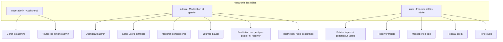

| Middleware | Rôle |
|---|---|
| authenticateToken | Vérification JWT + statut compte en base |
| authorizeRoles | Restriction par rôle (admin/superadmin) |
| requireAdmin | Raccourci : authorizeRoles admin et superadmin |
| requireSuperAdmin | Raccourci : authorizeRoles superadmin uniquement |
| blockAdmins | Interdit l'accès aux comptes admin/superadmin |
| requireDriver | Nécessite user.isDriver === true |
| requireVerifiedDriver | Nécessite isDriver et driverVerified |

### 13.3 Sécurité du Token JWT

| Paramètre | Valeur |
|---|---|
| Algorithme | HS256 HMAC SHA-256 |
| Durée de validité | 7 jours |
| Payload | id, email, role |
| Secret | Variable d'environnement JWT_SECRET min 32 chars |
| Révocation | Vérification du statut en base à chaque requête |

La révocation immédiate est un mécanisme de sécurité essentiel : un compte banni perd l'accès instantanément sans attendre l'expiration naturelle du token.

### 13.4 Protection Anti-Brute-Force OTP

Le rate limiter OTP est keyed par email et non par IP, empêchant la distribution d'attaques sur plusieurs adresses IP contre un même compte. Le code OTP est généré via `crypto.randomInt()` (cryptographiquement sûr) au lieu de Math.random() (prévisible).

---

## 14. Intégration de l'Intelligence Artificielle

### 14.1 Architecture IA Globale

AtlasWay intègre trois systèmes d'IA distincts, chacun répondant à un besoin métier précis :

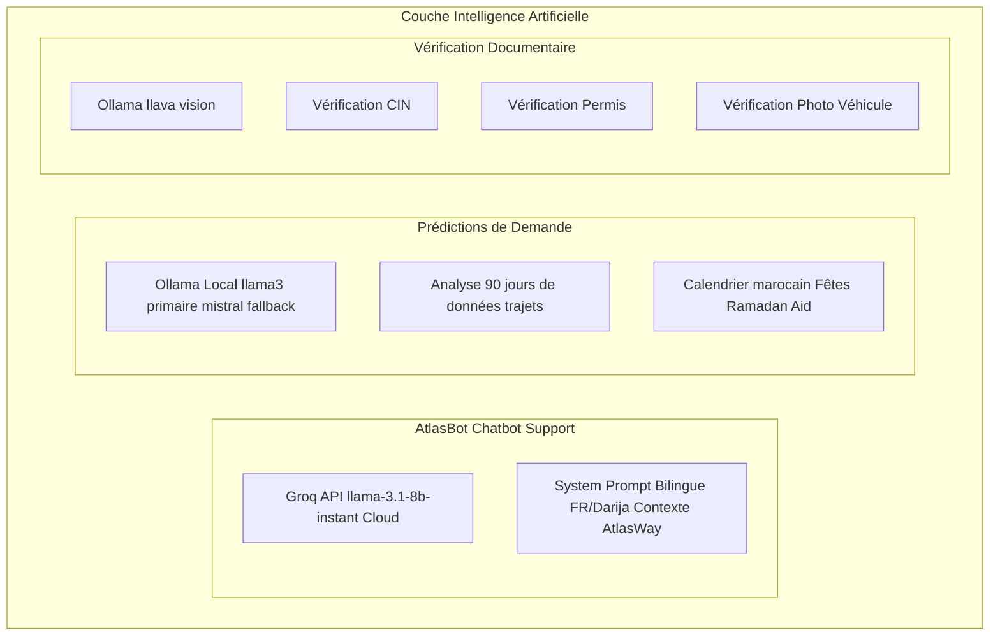

### 14.2 AtlasBot — Chatbot Support

AtlasBot est un assistant conversationnel intégré à l'interface web via un widget flottant accessible depuis toutes les pages.

| Paramètre | Valeur |
|---|---|
| Modèle | llama-3.1-8b-instant via Groq API |
| Température | 0.7 |
| Top-p | 0.9 |
| Max tokens par réponse | 600 |
| Historique conservé | 10 derniers messages |
| Langue | Français par défaut + Darija marocaine avec détection automatique |

Le System Prompt enrichi contient : identité du bot, prix moyens des trajets entre villes marocaines, numéros d'urgence (Police : 19, SAMU : 15, Gendarmerie : 177), et données en temps réel (nombre de trajets disponibles, villes actives).

### 14.3 Prédictions de Demande par IA

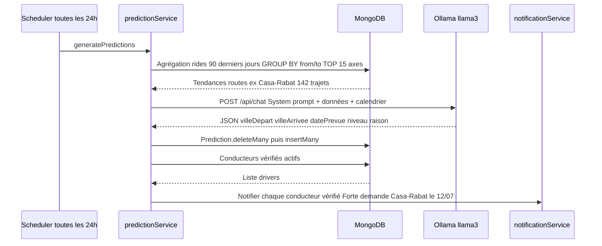

Le modèle reçoit en contexte : les données réelles des 90 derniers jours (TOP 15 axes), le calendrier marocain (fêtes nationales, Ramadan, Aïd El Fitr/Adha, weekends, matchs Botola).

### 14.4 Vérification Documentaire par Vision LLaVA

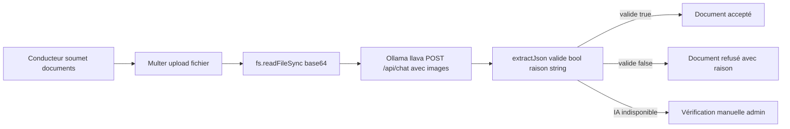

| Document | Critères de validation |
|---|---|
| CIN Carte d'Identité Nationale | Photo, nom, numéro de carte lisibles |
| Permis de conduire | Photo, catégories de permis visibles |
| Photo du véhicule | Voiture identifiable vue extérieure |

---

## 15. Système de Messagerie

### 15.1 Architecture Temps Réel Socket.io

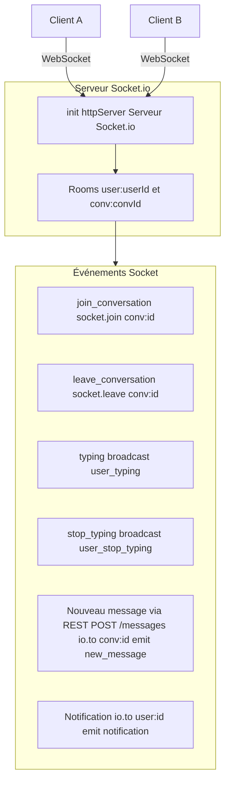

### 15.2 Flux d'Envoi d'un Message

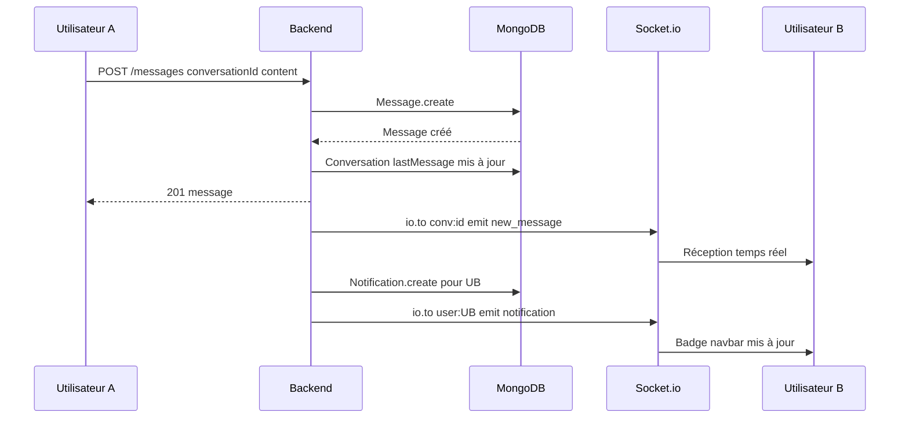

---

## 16. Gestion des Trajets

### 16.1 Cycle de Vie d'un Trajet

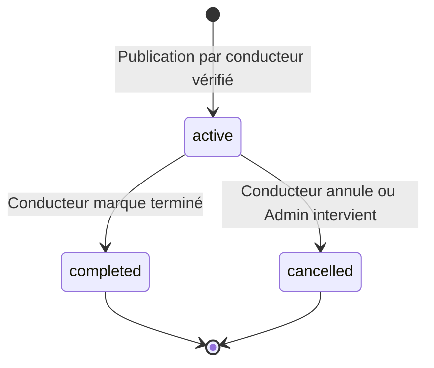

### 16.2 Conditions de Publication

Un trajet ne peut être publié que si trois conditions sont simultanément réunies :
1. Utilisateur authentifié avec rôle `user` (les admins sont explicitement bloqués via `blockAdmins`)
2. `user.isDriver === true` (via `requireDriver`)
3. `user.driverVerified === true` (via `requireVerifiedDriver`)

### 16.3 Moteur de Recherche Avancée

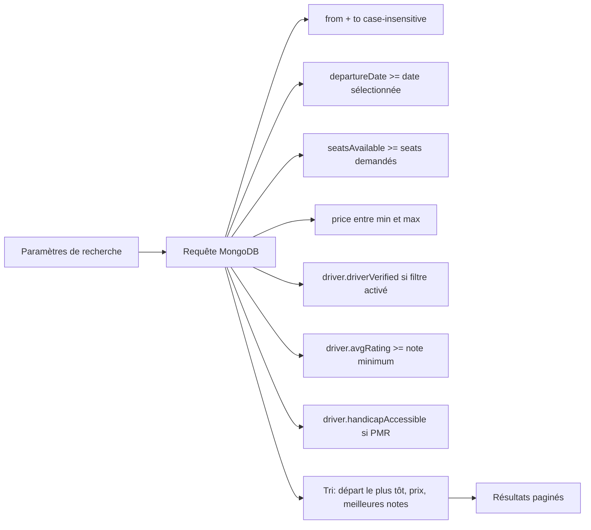

---

## 17. Flux de Réservation

### 17.1 Diagramme de Flux Complet

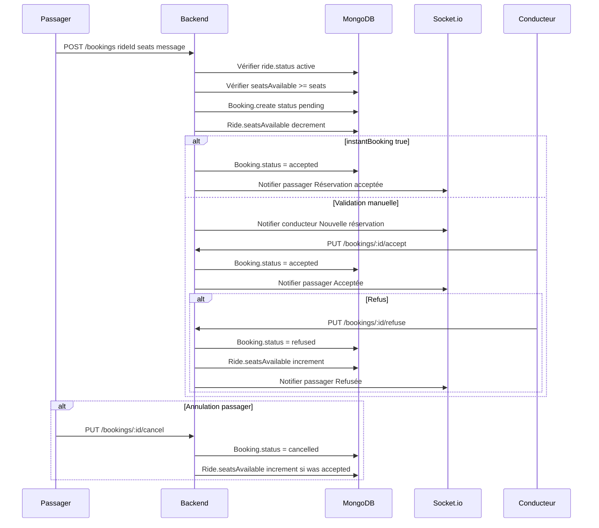

### 17.2 Statuts des Réservations

| Statut | Description | Transitions possibles |
|---|---|---|
| pending | En attente de validation conducteur | accepted, refused, cancelled |
| accepted | Acceptée par le conducteur | cancelled |
| refused | Refusée par le conducteur | terminal |
| cancelled | Annulée par le passager | terminal |

### 17.3 Calcul CO2 Économisé

```
CO2 économisé (kg) = distanceKm x 0.12 x (places réservées - 1)
```

Cette valeur est agrégée dans le tableau de bord conducteur et affichée côté passager.

---

## 18. Portefeuille et Paiements Stripe

### 18.1 Architecture de Paiement

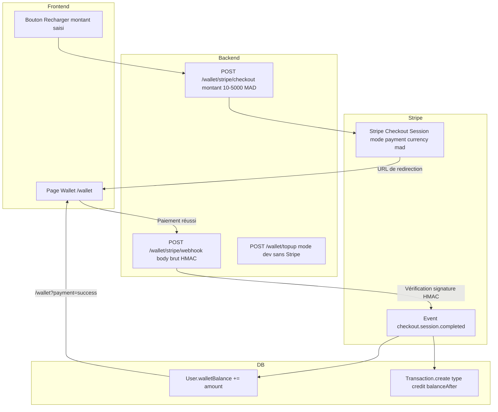

### 18.2 Sécurité Critique du Webhook

Le webhook Stripe est enregistré avant `express.json()` dans index.js pour conserver le body brut nécessaire à la vérification HMAC. Un body parsé invaliderait la vérification et ouvrirait la porte à des fraudes.

### 18.3 Atomicité des Transactions

Les opérations de portefeuille sont exécutées dans des transactions MongoDB (nécessitant le Replica Set) pour garantir l'atomicité : le solde et l'entrée Transaction sont mis à jour ensemble ou pas du tout.

---

## 19. Système de Notifications

### 19.1 Architecture Multicouche

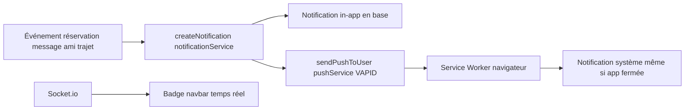

### 19.2 Types de Notifications

| Type | Déclencheur |
|---|---|
| booking | Nouvelle réservation, acceptation, refus, annulation |
| message | Nouveau message dans une conversation |
| review | Nouvel avis reçu |
| ride | Trajet correspondant à une recherche sauvegardée |
| system | Prédictions IA, badges débloqués, messages admin |

---

## 20. Vérification des Conducteurs

### 20.1 Workflow de Vérification

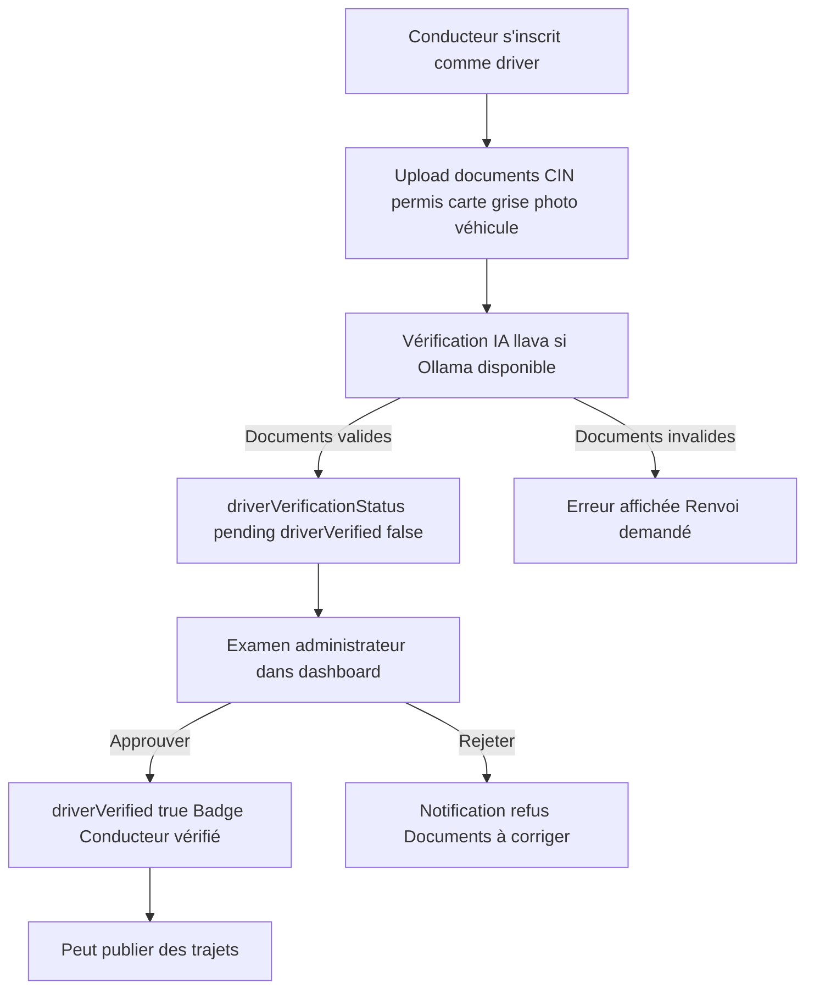

Un nouveau document soumis remet automatiquement `driverVerified` à `false`, forçant une nouvelle validation administrative.

---

## 21. Tableau de Bord Administrateur

### 21.1 Structure du Dashboard

```mermaid
graph TB
    ADMIN["AdminDashboard /admin"] --> TAB1["Tableau de bord stats + graphiques"]
    ADMIN --> TAB2["Utilisateurs liste + détail + actions"]
    ADMIN --> TAB3["Trajets liste + annulation + suppression"]
    ADMIN --> TAB4["Signalements modération"]
    ADMIN --> TAB5["Journal d'audit"]
    ADMIN --> TAB6["Admins superadmin uniquement"]

    TAB1 --> STATS["totalUsers totalDrivers totalRides totalBookings totalReports totalBanned"]
    TAB1 --> CHARTS["Graphiques Recharts Inscriptions 6 mois Trajets 6 mois Réservations par statut Signalements par statut"]
```

### 21.2 Actions Administratives et Garde-fous

| Action | Qui peut l'effectuer | Restrictions |
|---|---|---|
| Suspendre un utilisateur | Admin + Superadmin | Impossible sur soi-même ou un superadmin |
| Réactiver un utilisateur | Admin + Superadmin | Aucune restriction |
| Bannir un utilisateur | Admin + Superadmin | Impossible sur un superadmin sans être superadmin |
| Supprimer un utilisateur | Admin + Superadmin | Impossible sur un superadmin |
| Agir sur un compte admin | Superadmin uniquement | Un admin ne peut pas agir sur un autre admin |
| Annuler un trajet | Admin + Superadmin | Statut passe à cancelled |
| Supprimer un trajet | Admin + Superadmin | Suppression définitive + réservations en transaction |
| Créer un admin | Superadmin uniquement | Aucune restriction |

---

## 22. Sécurité de la Plateforme

### 22.1 Couches de Sécurité

```mermaid
graph TB
    REQ["Requête HTTP entrante"] --> TLS["TLS/HTTPS Render + Vercel"]
    TLS --> CORS["CORS Liste blanche de domaines atlasway.ma Vercel localhost"]
    CORS --> HELM["Helmet Headers sécurité HTTP"]
    HELM --> RATE["Rate Limiting Global 2000/15min Login 15/15min OTP 10/10min par email"]
    RATE --> VALID["express-validator Validation et Sanitisation"]
    VALID --> AUTH["authenticateToken JWT verify + DB status check"]
    AUTH --> RBAC["authorizeRoles blockAdmins requireDriver etc"]
    RBAC --> CTRL["Controller Logique métier"]
```

### 22.2 Tableau des Protections

| Mécanisme | Implémentation | Menace couverte |
|---|---|---|
| HTTPS | Render + Vercel TLS automatique | Interception réseau Man-in-the-Middle |
| Helmet | app.use helmet() | XSS Clickjacking MIME sniffing information disclosure |
| CORS restrictif | Liste blanche domaines production | Requêtes cross-origin non autorisées |
| bcrypt facteur 12 | bcrypt.hash password 12 | Vol de base de données mots de passe hachés |
| JWT signé | HS256 secret 32+ chars | Falsification de tokens |
| Révocation immédiate | DB check à chaque requête | Comptes bannis gardant l'accès |
| Rate limiting global | 2000 req / 15 min | DDoS applicatif scraping |
| Rate limiting login | 15 req / 15 min par IP | Brute-force de mot de passe |
| Rate limiting OTP | 10 req / 10 min par email | Brute-force de code OTP |
| Rate limiting signalements | Max 10 / 15 min | Spam de signalements |
| OTP cryptographique | crypto.randomInt | Prédictibilité du code OTP |
| express-validator | Validation + trim | Injection NoSQL XSS via input |
| Webhook HMAC | stripe.webhooks.constructEvent | Faux événements Stripe |
| Multer | Validation type et taille fichier | Upload de fichiers malveillants |
| Audit log | Toutes actions admin | Traçabilité non-répudiation |

### 22.3 Politique RGPD

La route `/privacy` offre deux fonctionnalités conformes au RGPD :
- **Export des données** : téléchargement de toutes les données personnelles en JSON
- **Suppression du compte** : suppression définitive de toutes les données

---

## 23. Aperçu de l'API REST

### 23.1 Conventions

| Convention | Valeur |
|---|---|
| Format | JSON application/json |
| Authentification | Bearer Token JWT |
| Versioning | Non versionné v1 implicite |
| Codes de succès | 200 OK, 201 Created |
| Codes d'erreur | 400, 401, 403, 404, 409, 500 |
| Pagination | Paramètres page et limit sur les listes |

### 23.2 Endpoints Principaux

**Authentification /auth**

| Méthode | Endpoint | Auth | Description |
|---|---|---|---|
| POST | /auth/register | Non | Inscription |
| POST | /auth/verify-email | Non | Vérification OTP |
| POST | /auth/resend-code | Non | Renvoi du code OTP |
| POST | /auth/login | Non | Connexion |
| POST | /auth/forgot-password | Non | Demande reset |
| POST | /auth/reset-password | Non | Réinitialisation |
| POST | /auth/change-password | Oui | Changement de mot de passe |

**Trajets /rides**

| Méthode | Endpoint | Auth | Description |
|---|---|---|---|
| GET | /rides/home | Non | Données page d'accueil |
| GET | /rides/search | Non | Recherche avec filtres |
| GET | /rides/mine | Oui | Mes trajets conducteur |
| GET | /rides/:id | Non | Détail d'un trajet |
| POST | /rides | Oui Driver vérifié | Publier un trajet |
| PUT | /rides/:id | Oui | Modifier un trajet |
| PUT | /rides/:id/complete | Oui | Marquer terminé |
| DELETE | /rides/:id | Oui | Supprimer un trajet |

**Réservations /bookings**

| Méthode | Endpoint | Auth | Description |
|---|---|---|---|
| POST | /bookings | Oui | Créer une réservation |
| GET | /bookings/me | Oui | Mes réservations passager |
| GET | /bookings/driver | Oui | Réservations reçues conducteur |
| GET | /bookings/pending-count | Oui | Nombre en attente |
| PUT | /bookings/:id/accept | Oui | Accepter |
| PUT | /bookings/:id/refuse | Oui | Refuser |
| PUT | /bookings/:id/cancel | Oui | Annuler |

**Portefeuille /wallet**

| Méthode | Endpoint | Auth | Description |
|---|---|---|---|
| GET | /wallet | Oui | Solde + dernières transactions |
| POST | /wallet/topup | Oui | Recharge directe mode dev |
| POST | /wallet/stripe/checkout | Oui | Initier Stripe Checkout |
| GET | /wallet/transactions | Oui | Historique complet |
| POST | /wallet/stripe/webhook | HMAC | Webhook Stripe |

**Administration /admin**

| Méthode | Endpoint | Auth | Description |
|---|---|---|---|
| GET | /admin/dashboard | Admin | Stats globales |
| GET | /admin/charts | Admin | Données graphiques |
| GET | /admin/users | Admin | Liste paginée utilisateurs |
| GET | /admin/users/:id | Admin | Détail utilisateur |
| PUT | /admin/users/:id/suspend | Admin | Suspendre |
| PUT | /admin/users/:id/activate | Admin | Réactiver |
| PUT | /admin/users/:id/ban | Admin | Bannir |
| DELETE | /admin/users/:id | Admin | Supprimer |
| GET | /admin/rides | Admin | Liste paginée trajets |
| PUT | /admin/rides/:id/cancel | Admin | Annuler trajet |
| DELETE | /admin/rides/:id | Admin | Supprimer trajet |
| GET | /admin/reports | Admin | Liste signalements |
| PUT | /admin/reports/:id | Admin | Traiter signalement |
| GET | /admin/audit-logs | Admin | Journal d'audit |

**Intelligence Artificielle**

| Méthode | Endpoint | Auth | Description |
|---|---|---|---|
| POST | /chat | Oui | Message AtlasBot |
| GET | /predictions | Non | Prédictions de demande |
| POST | /verify-driver/cin | Oui | Vérification CIN par IA |
| POST | /verify-driver/permis | Oui | Vérification permis par IA |
| POST | /verify-driver/voiture | Oui | Vérification photo véhicule |

---

## 24. Structure du Projet

### 24.1 Arborescence Complète

```
Projet-fin-d-annee/
├── backend/
│   ├── index.js                      # Point d'entrée serveur
│   ├── database.js                   # Connexion MongoDB
│   ├── socket.js                     # Serveur Socket.io
│   ├── package.json
│   ├── .env                          # Variables d'environnement
│   ├── .env.example                  # Template variables
│   ├── controllers/                  # 28 contrôleurs métier
│   │   ├── adminController.js
│   │   ├── analyticsController.js
│   │   ├── authController.js
│   │   ├── bookingController.js
│   │   ├── chatController.js
│   │   ├── driverVerificationController.js
│   │   ├── emergencyController.js
│   │   ├── eventController.js
│   │   ├── exportController.js
│   │   ├── favoriteController.js
│   │   ├── friendController.js
│   │   ├── groupController.js
│   │   ├── loginHistoryController.js
│   │   ├── messageController.js
│   │   ├── predictionController.js
│   │   ├── premiumController.js
│   │   ├── promoController.js
│   │   ├── reportController.js
│   │   ├── reviewController.js
│   │   ├── rideAlertController.js
│   │   ├── rideController.js
│   │   ├── savedSearchController.js
│   │   ├── storyController.js
│   │   ├── superadminController.js
│   │   ├── supportController.js
│   │   ├── userController.js
│   │   ├── waitlistController.js
│   │   └── walletController.js
│   ├── models/                       # 32 schémas Mongoose
│   │   ├── AdminLog.js
│   │   ├── AuditLog.js
│   │   ├── Booking.js
│   │   ├── Conversation.js
│   │   ├── ConversationMember.js
│   │   ├── EmergencyContact.js
│   │   ├── Event.js
│   │   ├── FavoriteRide.js
│   │   ├── Friendship.js
│   │   ├── Group.js
│   │   ├── GroupMember.js
│   │   ├── LoginHistory.js
│   │   ├── Message.js
│   │   ├── Notification.js
│   │   ├── Post.js
│   │   ├── PostComment.js
│   │   ├── PostLike.js
│   │   ├── PostReaction.js
│   │   ├── PostSave.js
│   │   ├── Prediction.js
│   │   ├── Premium.js
│   │   ├── PromoCode.js
│   │   ├── PushSubscription.js
│   │   ├── Report.js
│   │   ├── Review.js
│   │   ├── Ride.js
│   │   ├── RideAlert.js
│   │   ├── SavedSearch.js
│   │   ├── Story.js
│   │   ├── SupportTicket.js
│   │   ├── Transaction.js
│   │   ├── User.js
│   │   ├── VerificationCode.js
│   │   ├── WaitlistEntry.js
│   │   ├── index.js
│   │   └── plugins/
│   │       └── idPlugin.js
│   ├── routes/                       # 30+ fichiers de routes
│   ├── middleware/
│   │   ├── auditMiddleware.js
│   │   ├── authMiddleware.js
│   │   ├── errorMiddleware.js
│   │   ├── permissions.js
│   │   └── uploadMiddleware.js
│   ├── services/
│   │   ├── auditLogService.js
│   │   ├── emailService.js
│   │   ├── notificationService.js
│   │   ├── ollamaService.js
│   │   ├── ollamaVisionService.js
│   │   ├── predictionService.js
│   │   ├── pushService.js
│   │   ├── savedSearchService.js
│   │   ├── seedService.js
│   │   ├── smsService.js
│   │   └── stripeService.js
│   ├── utils/
│   │   └── walletTransaction.js
│   ├── uploads/
│   └── __tests__/
│       ├── auth.test.js
│       └── rides.test.js
│
├── web/                              # Frontend React 18 PWA
│   ├── index.html
│   ├── vite.config.js
│   ├── tailwind.config.js
│   ├── package.json
│   ├── vercel.json
│   ├── public/
│   │   ├── sw.js                     # Service Worker personnalisé
│   │   ├── manifest.json
│   │   ├── logo.svg
│   │   ├── pwa-192.png
│   │   └── pwa-512.png
│   └── src/
│       ├── App.jsx                   # Routing principal + Providers
│       ├── main.jsx
│       ├── index.css
│       ├── pages/                    # 35 pages applicatives
│       ├── components/               # Composants réutilisables
│       ├── context/                  # AuthContext ThemeContext LanguageContext
│       ├── hooks/
│       ├── services/                 # Clients Axios
│       ├── utils/
│       └── test/
│
├── mobile/                           # App React Native
│   ├── App.tsx
│   ├── package.json
│   ├── tsconfig.json
│   ├── app.json
│   └── src/
│       ├── screens/
│       │   ├── Auth/
│       │   │   ├── LoginScreen.tsx
│       │   │   ├── RegisterScreen.tsx
│       │   │   └── VerifyCodeScreen.tsx
│       │   ├── Home/
│       │   └── Chat/
│       ├── navigation/
│       │   └── AppNavigator.tsx
│       ├── context/
│       ├── services/
│       │   └── api.ts
│       ├── components/
│       ├── hooks/
│       └── utils/
│
├── uml/
├── documentation/
│   ├── REPORT.md
│   └── screenshots/
├── README.md
├── prj.md
└── package.json
```

---

## 25. Organisation du Code

### 25.1 Principes Architecturaux

**Séparation des responsabilités** : chaque couche a une responsabilité unique et clairement définie. Les contrôleurs orchestrent les opérations, les services encapsulent les appels externes, les modèles définissent la structure des données.

**DRY (Don't Repeat Yourself)** : le RBAC centralisé dans `permissions.js` évite la duplication de vérifications de rôles dans chaque contrôleur. `notificationService` centralise la logique d'envoi de notifications.

**Fail-fast** : la validation des entrées via `express-validator` intervient le plus tôt possible dans le pipeline, avant tout accès à la base de données.

**Graceful degradation** : les services optionnels (Ollama, Stripe, Twilio) se dégradent gracieusement si non configurés, avec des fallbacks en mode développement.

### 25.2 Conventions de Nommage

| Élément | Convention | Exemple |
|---|---|---|
| Fichiers contrôleurs | camelCaseController.js | bookingController.js |
| Fichiers routes | camelCaseRoutes.js | rideRoutes.js |
| Modèles Mongoose | PascalCase.js | Booking.js |
| Services | camelCaseService.js | stripeService.js |
| Pages React | PascalCase.jsx | SearchRides.jsx |
| Composants React | PascalCase.jsx | ChatWidget.jsx |
| Contextes | PascalCaseContext.jsx | AuthContext.jsx |

### 25.3 Variables d'Environnement

| Variable | Obligatoire | Usage |
|---|---|---|
| PORT | Non 4000 | Port du serveur Express |
| NODE_ENV | Non development | Mode d'exécution |
| MONGODB_URI | Oui | URI de connexion MongoDB |
| JWT_SECRET | Oui | Clé de signature JWT min 32 chars |
| GMAIL_USER / GMAIL_PASS | Recommandé | Envoi emails OTP |
| SMTP_HOST / SMTP_PORT | Alternatif | SMTP générique |
| STRIPE_SECRET_KEY | Non | Paiements réels |
| STRIPE_WEBHOOK_SECRET | Non | Vérification webhooks |
| TWILIO_ACCOUNT_SID | Non | SMS OTP |
| VAPID_PUBLIC / VAPID_PRIVATE | Non | Notifications push |
| OLLAMA_URL | Non localhost:11434 | Serveur Ollama |
| GROQ_API_KEY | Non | AtlasBot via Groq |

---

## 26. Stratégie de Tests

### 26.1 Tests Actuels

Le projet dispose d'une suite de tests backend avec Jest et Supertest :

```
backend/__tests__/
├── auth.test.js    — Tests d'authentification inscription connexion OTP
└── rides.test.js   — Tests gestion trajets CRUD filtres permissions
```

Les tests frontend utilisent Vitest avec React Testing Library (configuré dans web/src/test/).

```bash
# Backend
cd backend
npm test                   # Tests unitaires et intégration
npm run test:coverage      # Avec rapport de couverture

# Frontend
cd web
npm test                   # Tests Vitest
npm run test:ui            # Interface graphique Vitest
```

### 26.2 Tests Recommandés

| Type | Priorité | Scénarios |
|---|---|---|
| Tests d'authentification | Haute | Inscription valide/invalide login brute-force expiration JWT |
| Tests RBAC | Haute | Accès refusé selon rôle blockAdmins requireVerifiedDriver |
| Tests de réservation | Haute | Flux complet surréservation impossible concurrence |
| Tests de portefeuille | Haute | Transactions atomiques webhook Stripe simulé |
| Tests de messagerie | Moyenne | Émission réception Socket.io |
| Tests de recherche | Moyenne | Filtres multiples pagination |
| Tests intégration IA | Basse | Mock Groq/Ollama parsing JSON |
| Tests E2E Playwright | Haute production | Flux complet utilisateur |

### 26.3 Checklist de Tests Manuels

- [ ] Inscription avec vérification email et SMS
- [ ] Connexion et révocation de compte banni
- [ ] Publication de trajet conducteur non vérifié bloqué
- [ ] Réservation instantanée vs manuelle
- [ ] Recharge portefeuille via Stripe mode test
- [ ] Envoi et réception de messages en temps réel
- [ ] Signalement et modération admin
- [ ] AtlasBot en français et en darija
- [ ] Prédictions IA si Ollama disponible
- [ ] Vérification documentaire CIN si LLaVA disponible
- [ ] Export RGPD des données
- [ ] Installation PWA sur mobile

---

## 27. Considérations de Performance

### 27.1 Optimisations Frontend

| Optimisation | Mécanisme |
|---|---|
| Code splitting | React.lazy + Suspense 35 pages chargées à la demande |
| Chunking manuel | manualChunks Vite vendor-react vendor-charts vendor-maps vendor-socket vendor-ui |
| Pré-bundling Vite | optimizeDeps.include évite la ré-optimisation |
| Assets PWA | Service Worker avec cache stratégique |
| Tree shaking | Vite élimine le code mort à la compilation |

### 27.2 Optimisations Backend

| Optimisation | Mécanisme |
|---|---|
| Index MongoDB | Index composites sur les requêtes fréquentes rides messages bookings |
| Projections Mongoose | select pour ne charger que les champs nécessaires |
| Populate sélectif | Chargement des relations uniquement quand nécessaire |
| Connexion persistante | Pool de connexions MongoDB Mongoose |
| Async/await | Traitement non-bloquant Node.js Event Loop préservée |
| Rate limiting | Protection contre les pics de charge abusifs |

### 27.3 Métriques Cibles

| Métrique | Cible |
|---|---|
| Réponse API endpoints simples | < 100 ms |
| Réponse API avec agrégation | < 300 ms |
| First Contentful Paint FCP | < 1.5 s |
| Time to Interactive TTI | < 3 s |
| Latence Socket.io | < 50 ms LAN |

---

## 28. Scalabilité

### 28.1 Architecture Stateless

Le backend est conçu comme un service stateless : aucune session serveur, tout l'état utilisateur est porté par le JWT et vérifié en base à chaque requête. Cette approche permet un déploiement multi-instances sans état partagé.

```mermaid
graph LR
    LB["Load Balancer"] --> BE1["Backend Instance 1 Node.js:4000"]
    LB --> BE2["Backend Instance 2 Node.js:4000"]
    LB --> BE3["Backend Instance N Node.js:4000"]
    BE1 --> DB[("MongoDB Atlas Replica Set")]
    BE2 --> DB
    BE3 --> DB
    BE1 --> REDIS["Redis à prévoir Sessions Socket.io Cache"]
    BE2 --> REDIS
    BE3 --> REDIS
```

### 28.2 Limites Actuelles et Solutions

| Limite | Solution à prévoir |
|---|---|
| Socket.io mono-instance | Redis Adapter @socket.io/redis-adapter pour rooms partagées |
| Uploads locaux | Migration vers Cloudinary ou S3 dépendance déjà installée |
| Ollama local | Instance GPU dédiée ou API cloud Groq déjà utilisé pour AtlasBot |
| Rate limiting en mémoire | Redis pour partage entre instances rate-limit-redis |

### 28.3 Scalabilité des Données

MongoDB Atlas offre scalabilité horizontale native via le sharding :
- rides : sharding par from et to (répartition géographique)
- bookings : sharding par passengerId
- messages : sharding par conversationId

---

## 29. Déploiement

### 29.1 Architecture de Déploiement

```mermaid
graph TB
    subgraph Production
        VERCEL["Vercel Frontend React https://web-omega-one-58.vercel.app ou atlasway.ma"]
        RENDER["Render Backend Node.js https://*.onrender.com"]
        ATLAS[("MongoDB Atlas Cloud MongoDB Replica Set 3 noeuds")]
    end

    subgraph CICD["CI/CD"]
        GIT["Git Repository"]
        GIT -->|"Push deploy auto"| VERCEL
        GIT -->|"Push deploy auto"| RENDER
    end

    VERCEL -->|"HTTPS API calls"| RENDER
    RENDER --> ATLAS
    RENDER -->|"Self-ping 14min"| RENDER
```

### 29.2 Configuration Render Backend

| Paramètre | Valeur |
|---|---|
| Runtime | Node.js 18+ |
| Commande de build | npm install |
| Commande de démarrage | npm start node index.js |
| Plan | Free tier avec self-ping anti-sleep |
| NODE_ENV | production |
| RENDER_EXTERNAL_URL | URL publique pour le self-ping |

**Self-ping** : en production le backend s'auto-appelle sur /health toutes les 14 minutes via HTTPS pour éviter la mise en veille du service Render Free Tier.

### 29.3 Configuration Vercel Frontend

| Paramètre | Valeur |
|---|---|
| Framework | Vite |
| Commande de build | npm run build |
| Répertoire de sortie | dist/ |
| Rewrites SPA | Toutes routes vers index.html via vercel.json |

### 29.4 Installation Locale

```bash
# 1. Prérequis
# Node.js 18+, MongoDB avec Replica Set activé
# Optionnel : ollama pull llama3 && ollama pull llava

# 2. Backend
cd backend
cp .env.example .env
npm install
npm start            # http://localhost:4000

# 3. Frontend dans un nouveau terminal
cd ../web
npm install
npm run dev          # http://localhost:5173
```

**Comptes de test :**

| Rôle | Email | Mot de passe |
|---|---|---|
| Super Admin | superadmin@atlasway.com | superadmin123 |
| Admin | admin@atlasway.com | admin123 |

---

## 30. Points Forts du Projet

1. **Architecture full-stack cohérente** : frontend, backend et mobile partagent le même paradigme JavaScript/TypeScript, réduisant la fragmentation technologique.

2. **Sécurité en profondeur** : défense multicouche (TLS, Helmet, CORS, rate limiting, bcrypt, JWT, révocation immédiate, audit log) conforme aux meilleures pratiques OWASP.

3. **Intelligence artificielle intégrée** : trois cas d'usage IA complémentaires (support conversationnel, prédiction de demande, vérification documentaire) apportant une valeur différenciante concrète.

4. **PWA avancée** : l'application web est installable, fonctionne partiellement hors ligne et envoie des notifications push, effaçant la frontière avec une application native.

5. **Temps réel natif** : Socket.io utilisé pour la messagerie et les notifications, offrant une expérience fluide sans polling.

6. **Base de données exhaustive** : 32 collections MongoDB couvrant l'intégralité du domaine fonctionnel, avec index composites optimisés et transactions ACID pour les opérations critiques.

7. **RBAC centralisé** : le contrôle d'accès basé sur les rôles est factorisé en un seul fichier permissions.js, facilitant l'audit de sécurité et l'évolution des règles.

8. **Réseau social intégré** : fil d'actualité, stories, groupes et événements transformant AtlasWay en communauté, augmentant la rétention utilisateur.

9. **Localisation marocaine** : prix en MAD, vérification via CIN marocaine, prédictions calées sur le calendrier des fêtes nationales, support de la darija.

10. **RGPD prêt** : export et suppression de données implémentés dès la version initiale.

---

## 31. Limitations

| Limitation | Description | Impact |
|---|---|---|
| Paiement Stripe non activé en prod | Clés Stripe non configurées en production | Transactions réelles indisponibles |
| Ollama en local uniquement | Nécessite machine locale avec GPU | Prédictions et vision inopérantes en prod sans serveur dédié |
| Uploads locaux | Stockage sur disque Render éphémère | Fichiers perdus au redéploiement |
| Application mobile incomplète | Seul le flux auth est implémenté | App non publiable sur les stores |
| Socket.io mono-instance | Pas d'adaptateur Redis | Scalabilité horizontale du temps réel impossible |
| Tests insuffisants | Seulement 2 fichiers de tests backend | Couverture de code faible |
| SMS Twilio non configuré | En production indisponible | Uniquement OTP par email disponible |
| Paiement à la réservation absent | Le wallet n'est pas débité à la réservation | Recharge uniquement |

---

## 32. Améliorations Futures

### 32.1 Court Terme (0 - 3 mois)

- Activation et test complet du flux Stripe en production
- Migration des uploads vers Cloudinary (dépendance déjà installée)
- Augmentation de la couverture de tests à 70 % des contrôleurs
- Configuration SMS Twilio en production
- Déploiement d'une instance Ollama sur serveur GPU dédié

### 32.2 Moyen Terme (3 - 6 mois)

- Application mobile complète : portage trajets, réservations, messagerie, wallet vers React Native
- Publication sur App Store iOS et Google Play Store
- Paiement à la réservation : débit automatique wallet passager + commission plateforme
- Redis Adapter : scalabilité Socket.io multi-instances
- FCM : notifications push mobiles via Firebase Cloud Messaging
- Suivi GPS temps réel : streaming position conducteur vers passagers
- OCR avancé : extraction automatique des informations CIN et permis
- Tests E2E Playwright couvrant les parcours utilisateurs critiques

### 32.3 Long Terme (6 - 18 mois)

- API publique : ouverture à des partenaires tiers
- Programme de fidélité : système de points et récompenses
- AtlasBot v2 : intégration historique trajets utilisateur, suggestions personnalisées
- Covoiturage urbain : extension aux trajets intra-urbains (CityRide préparé dans le code)
- Plateforme entreprise : gestion de flotte, facturation B2B (EnterpriseDashboard préparé)
- Assurance trajet : partenariat avec assureurs pour couverture optionnelle
- Certification CMI : intégration du système de paiement bancaire marocain
- IA prédictive avancée : recommandations personnalisées basées sur l'historique

---

## 33. Conclusion

AtlasWay représente une contribution ambitieuse et techniquement solide à l'écosystème de la mobilité numérique marocaine. En combinant une architecture full-stack moderne, des fonctionnalités d'intelligence artificielle différenciantes et une attention particulière portée à la sécurité et à l'expérience utilisateur, le projet dépasse le cadre d'un exercice académique pour se positionner comme une solution à potentiel commercial réel.

Le choix de MongoDB pour la flexibilité des données, de Socket.io pour le temps réel, de Stripe pour les paiements et de Groq/Ollama pour l'IA démontre une capacité à sélectionner les technologies adaptées à chaque besoin.

La localisation marocaine — support de la darija, vérification via CIN marocaine, prix en dirhams, prédictions calées sur le calendrier des fêtes nationales — témoigne d'une compréhension fine du marché cible, souvent absente des projets académiques.

Les limitations identifiées (uploads locaux, mobile incomplet, Ollama en production) sont des questions d'ingénierie bien maîtrisées dont les solutions sont connues et budgetées dans la roadmap. Elles ne remettent pas en cause la solidité de l'architecture fondamentale.

En définitive, AtlasWay constitue une base technique saine, sécurisée et évolutive, sur laquelle une équipe produit pourrait construire une offre commerciale compétitive sur le marché marocain du covoiturage.

---

## 34. Références

| Référence | Type | Source |
|---|---|---|
| Node.js Documentation | Documentation officielle | https://nodejs.org/docs |
| Express.js Guide | Documentation officielle | https://expressjs.com |
| Mongoose Documentation | Documentation officielle | https://mongoosejs.com/docs |
| Socket.io Documentation | Documentation officielle | https://socket.io/docs |
| React Documentation | Documentation officielle | https://react.dev |
| Vite Documentation | Documentation officielle | https://vitejs.dev |
| Tailwind CSS Documentation | Documentation officielle | https://tailwindcss.com/docs |
| Stripe API Reference | Documentation officielle | https://stripe.com/docs/api |
| Groq Documentation | Documentation officielle | https://console.groq.com/docs |
| Ollama Documentation | Documentation officielle | https://ollama.ai/docs |
| Web Push Protocol | RFC 8030 | https://datatracker.ietf.org/doc/rfc8030 |
| JWT RFC 7519 | Spécification | https://datatracker.ietf.org/doc/rfc7519 |
| OWASP Top 10 | Guide sécurité | https://owasp.org/www-project-top-ten |
| PWA Documentation | Google Web Dev | https://web.dev/progressive-web-apps |
| React Native Documentation | Documentation officielle | https://reactnative.dev/docs |
| Vercel Documentation | Documentation déploiement | https://vercel.com/docs |
| Render Documentation | Documentation déploiement | https://render.com/docs |
| MongoDB Atlas Documentation | Documentation cloud | https://www.mongodb.com/docs/atlas |
| RGPD CNIL | Réglementation | https://www.cnil.fr/fr/rgpd-de-quoi-parle-t-on |
| Helmet.js | Bibliothèque sécurité | https://helmetjs.github.io |

---

<div align="center">

---

*AtlasWay — Plateforme Intelligente de Covoiturage au Maroc*

*Adam Khoulani · Yassine H. — ESISA — 2024/2025*

*Document généré dans le cadre du Projet de Fin d'Études*

---

</div>
